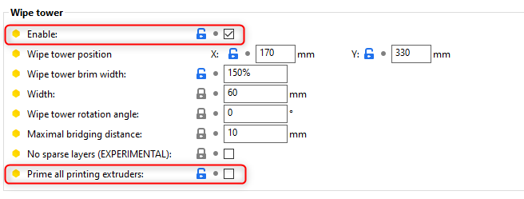
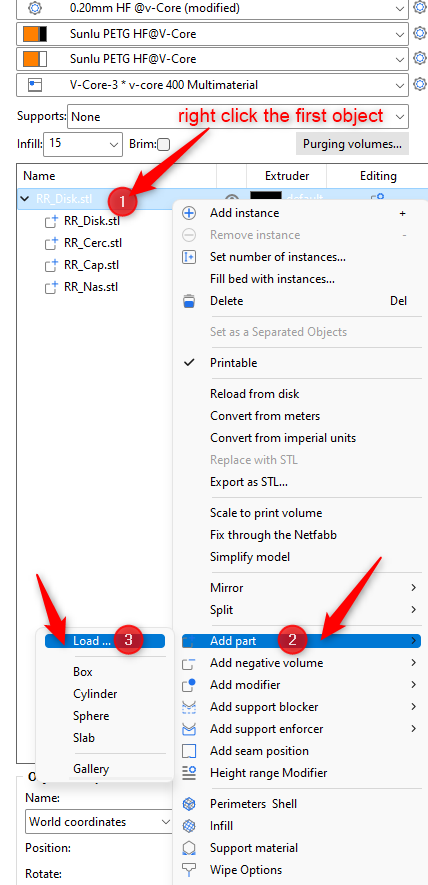

# How to set-up SuperSlicer to work with multi-colour material

## Prerequisites
- SuperSlicer (tested with: v2.4.58.4, v2.4.58.5, v2.5.59.0 and nightly v2.5.59.2)
- Expert settings enabled

## HowTo Step-by-step
1. Printer Settings 
   - General -> Capabilities -> Extruders = 2
   - General -> Capabilities -> Single Extruder Multi Material = True
 

1. **Save & Restart SuperSlicer**
 
2. Printer Settings, set all Single extruder multimaterial parameters to 0:
   
   - General -> Use relative E distances = enable
   - Custom G-code -> Tool change g-code: add "PAUSE" (without the ")
 

 1. Filament settings
      - Multimaterial settings -> Wipe tower parameters -> Minimal purge on wipe tower = 200 for V6 and 500 for Volcano
      - Multimaterial settings -> Wipe tower parameters -> Max speed on the wipe tower = 300%
      - Multimaterial settings -> Toolchange parameters with single extruder MM printers -> Number of cooling moves = 0
      - Multimaterial settings -> Toolchange parameters with single extruder MM printers -> Ramming parameters
        - Turn off all Ramming settings:
          
 2. Print settings
      - Multiple extruders -> wipe tower = enable
      - Multiple extruders -> wipe tower -> "Prime all printing extruders" is not set
        

## How to slice the objects with different colours
- The object that need to be printed in several colours must be made out of several smaller objects, for each colour a separate one, so first split the object
- Import all of the objects in SuperSlicer: first the base object, then right click it -> Add part -> Load
  
  
  
  
- Associate them with different extruders
- Slice it and start the print
- When the print pauses, swap the filament and then click resume

## Example 
You can use this example SS Project: [RR_Disk.3mf](RR_Disk.3mf)

## Special Thanks:
Helge Keck for writing the initial version for the RatRig Discord Community