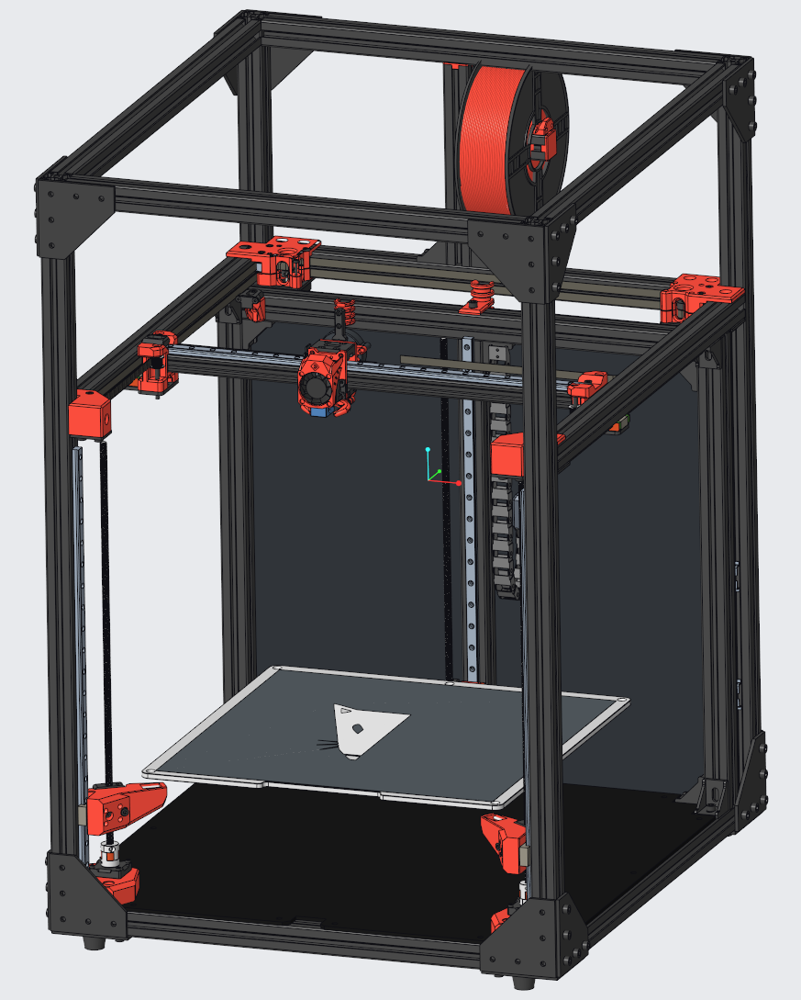
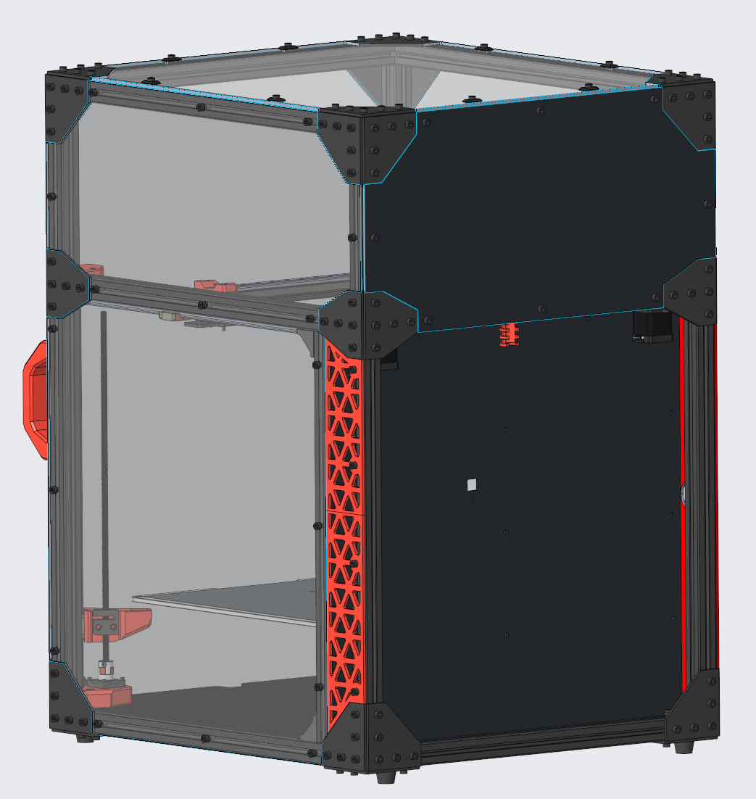
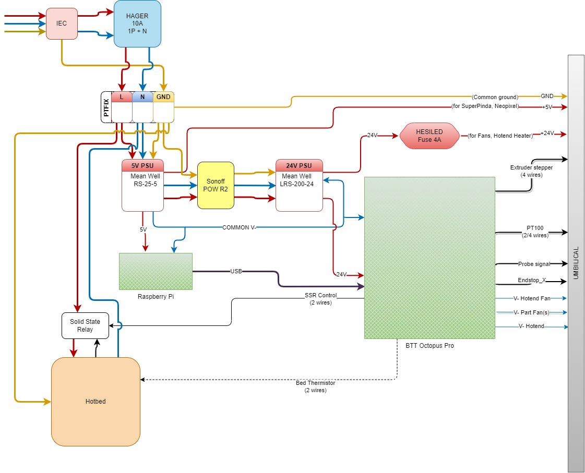

# VCore3-400-OpenFront

This is my take at the VCore-3 3D printer from RatRig.

It contains several mods already, the basis is the 400mm VCore-3 from RatRig [https://www.ratrig.com/3d-printing-cnc/3d-printer-kits/all-3d-printer-kits/v-core3configurable.html](https://www.ratrig.com/3d-printing-cnc/3d-printer-kits/all-3d-printer-kits/v-core3configurable.html). The mods I decided to build are: 

* OpenFront Mod: [https://www.thingiverse.com/thing:5140728](https://www.thingiverse.com/thing:5140728)
* Various smaller mods from users of the RatRig community:
  * Jevermeister
    *  [RatRig V-Core 3 Bed Arms heat-set insert mod](https://www.prusaprinters.org/prints/145226-ratrig-v-core-3-bed-arms-heat-set-insert-mod)
    *  Motor Cage with Lips
    *  Stronger Pillow Blocks
  * MFBS
    * [LGX Lite Fast-Swap-Rigid Gold Series EVA mod](https://www.thingiverse.com/thing:5207408)
    * [Gold Series Rat Rig V-Core 3, XY joiners with clamping mod](https://www.thingiverse.com/thing:4947482)
  * ...and some smaller ones ;)

Many thanks to everybody investing lots of work to make this great 3D printer an even better one!

Here is the wiring diagram I will be using. **If you decide to use it, please acknowledge that you are doing this on your own risk!**

