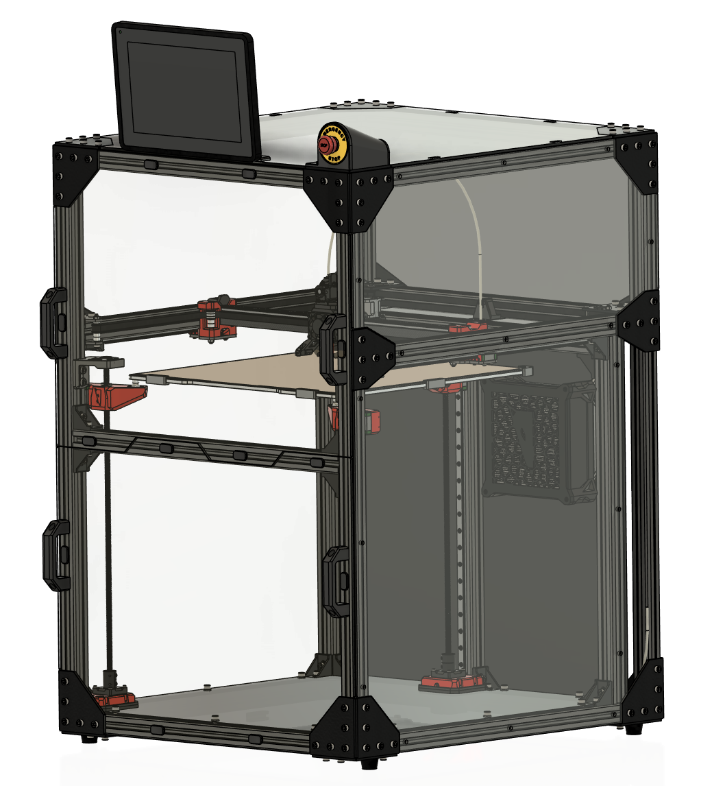
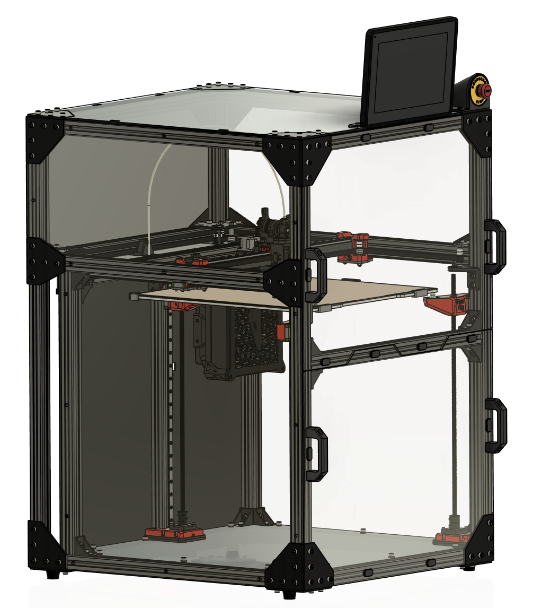
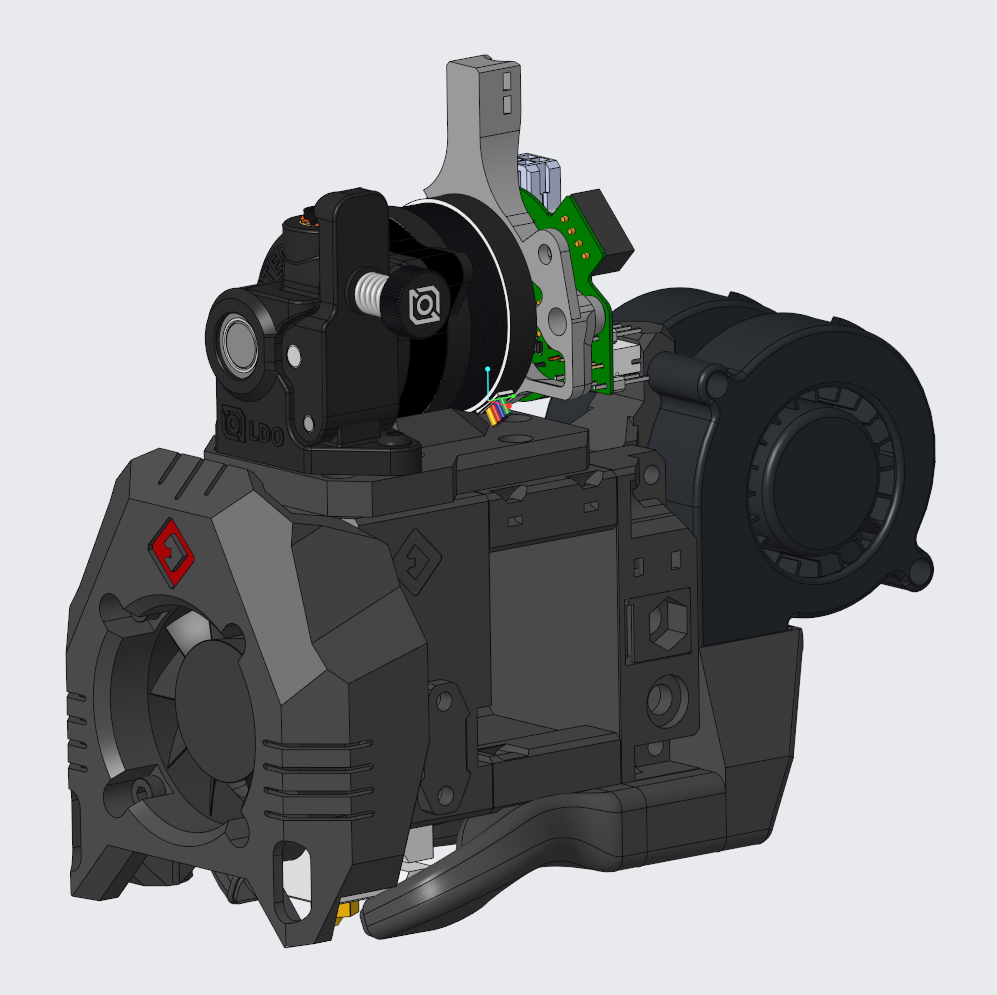

# VCore3.0 400mm OpenFront

This is my take at the VCore-3 3D printer from RatRig.

It contains several mods already, the basis is the 400mm VCore-3 from RatRig [https://www.ratrig.com/3d-printing-cnc/3d-printer-kits/all-3d-printer-kits/v-core3configurable.html](https://www.ratrig.com/3d-printing-cnc/3d-printer-kits/all-3d-printer-kits/v-core3configurable.html). The mods I decided to build are: 

* OpenFront Mod: [https://www.thingiverse.com/thing:5140728](https://www.thingiverse.com/thing:5140728)
* Various smaller mods from users of the RatRig community (many thanks to everybody making this great 3D printer an even better one!):
  * [RatRig V-Core 3 Bed Arms heat-set insert mod](https://www.prusaprinters.org/prints/145226-ratrig-v-core-3-bed-arms-heat-set-insert-mod)
  * [RatRig V-Core 3 reinforced and sealed rear motor mount](https://www.printables.com/model/158467-ratrig-v-core-3-reinforced-and-sealed-rear-motor-m)
  * Stronger Pillow Blocks
  * [LGX Lite Fast-Swap-Rigid Gold Series EVA mod](https://www.thingiverse.com/thing:5207408)
  * [Gold Series Rat Rig V-Core 3, XY joiners with clamping mod](https://www.thingiverse.com/thing:4947482)
* ...and my own mods:
  * [My Enclosure](https://www.printables.com/model/270834-enclosure-for-my-ratrig-v-core3-400mm-openfront)
  * [Magnetic holder for PC/Acrylic panels](https://www.printables.com/model/229334-magnetic-holder-for-pcacrylic-panels)
  * [DIN Rail Endcaps for M6x12 Cap Screws](https://www.printables.com/model/152627-din-rail-endcaps-for-m6x12-cap-screws)
  * [DIN Rail Adapter for Meanwell RS-25-5](https://www.printables.com/model/152624-din-rail-adapter-for-meanwell-rs-25-5)
  * [DIN Rail Adapter for Meanwell LRS-200-24 for V-Core3 400](https://www.printables.com/model/152620-din-rail-adapter-for-meanwell-lrs-200-24-for-v-cor)
  * [Fastener for Igus Chain on VCore3](https://www.printables.com/model/145317-fastener-for-igus-chain-on-vcore3)

## How it looks

Here is the wiring diagram I will be using. **If you decide to use it, please acknowledge that you are doing this on your own risk!**

## Printhead

## BOM
Here is my Bill of Material (BOM): [GoogleDrive](https://docs.google.com/spreadsheets/d/1t07DfJ-j9_pQZ918qX5IQbVI45c6goUu2t6Ui3eUhBY/edit?usp=sharing)

## Contact
* [Discord](https://discord.com) user: [Dinu#6139](http://discordapp.com/users/704373657648234526)
