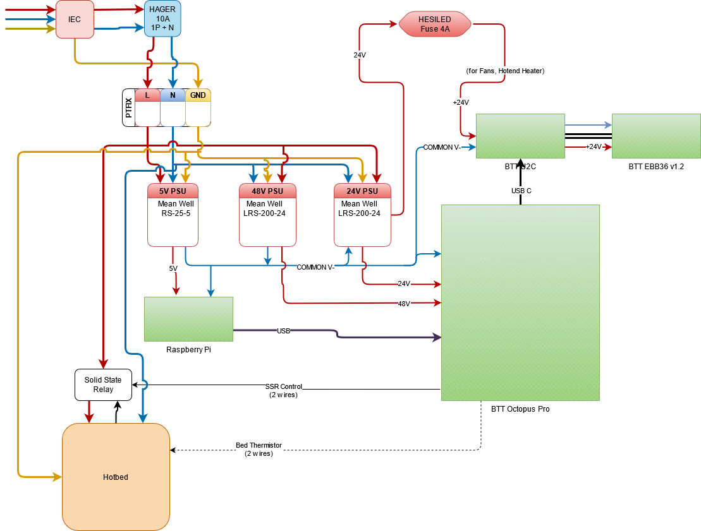

# VCore3-400-OpenFront

This is my take at the VCore-3 3D printer from RatRig.

It contains several mods already, the basis is the 400mm VCore-3 from RatRig [https://www.ratrig.com/3d-printing-cnc/3d-printer-kits/all-3d-printer-kits/v-core3configurable.html](https://www.ratrig.com/3d-printing-cnc/3d-printer-kits/all-3d-printer-kits/v-core3configurable.html). The mods I decided to build are: 

* OpenFront Mod: [https://www.thingiverse.com/thing:5140728](https://www.thingiverse.com/thing:5140728)
* Various smaller mods from users of the RatRig community:
  * Jevermeister
    *  [RatRig V-Core 3 Bed Arms heat-set insert mod](https://www.prusaprinters.org/prints/145226-ratrig-v-core-3-bed-arms-heat-set-insert-mod)
    *  [RatRig V-Core 3 reinforced and sealed rear motor mount](https://www.printables.com/model/158467-ratrig-v-core-3-reinforced-and-sealed-rear-motor-m)
    *  Stronger Pillow Blocks
  * MFBS
    * [LGX Lite Fast-Swap-Rigid Gold Series EVA mod](https://www.thingiverse.com/thing:5207408)
    * [Gold Series Rat Rig V-Core 3, XY joiners with clamping mod](https://www.thingiverse.com/thing:4947482)
  * my own
    * [DIN Rail Endcaps for M6x12 Cap Screws](https://www.printables.com/model/152627-din-rail-endcaps-for-m6x12-cap-screws)
    * [DIN Rail Adapter for Meanwell RS-25-5](https://www.printables.com/model/152624-din-rail-adapter-for-meanwell-rs-25-5)
    * [DIN Rail Adapter for Meanwell LRS-200-24 for V-Core3 400](https://www.printables.com/model/152620-din-rail-adapter-for-meanwell-lrs-200-24-for-v-cor)
    * [Fastener for Igus Chain on VCore3](https://www.printables.com/model/145317-fastener-for-igus-chain-on-vcore3)
  * ...and some smaller ones, such as (but not limited to):
    * [RatRig V-Core 3 IEC Adapter remix](https://www.printables.com/model/137719-ratrig-v-core-3-iec-adapter-remix)

Many thanks to everybody investing lots of work to make this great 3D printer an even better one!

## Looks

Here is the wiring diagram I will be using. **If you decide to use it, please acknowledge that you are doing this on your own risk!**

## BOM
Here is my Bill of Material (BOM): [GoogleDrive](https://docs.google.com/spreadsheets/d/1t07DfJ-j9_pQZ918qX5IQbVI45c6goUu2t6Ui3eUhBY/edit?usp=sharing)

## Loveboard to Igus CF9 Cable to PTFIX 
Here is the matching between the Loaveboard 20p MOLEX to the Igus CF9 cable colors and PTFIX: [GoogleDrive](https://docs.google.com/spreadsheets/d/14HSkR9IJcxvyp0iN5hX_ws5Iole1--FCSVv5XQ0tlTc/edit?usp=sharing)

## Printhead

## Current Looks

